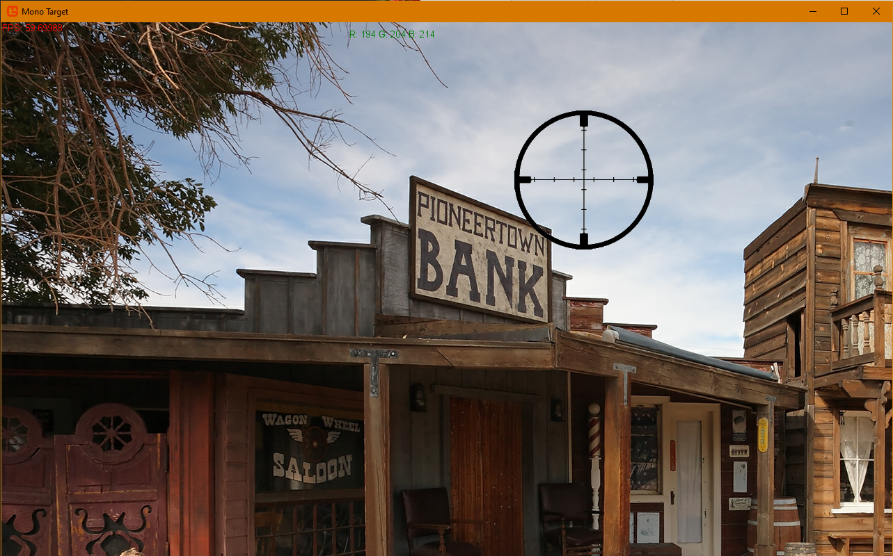

# MonoTarget - Day 1

## Thoughts
I'm thinking that to get pixel accuracy I will need to be able to evaluate the rgb value under the cursor when fired.  Somehow we will determine the material type or object type that was struck and behave appropriately.

## Work
- Created base MonoGame Windows project
- Found a good background scene graphic
- Created a crosshair as a mouse cursor.  Moves as the mouse moves.
- Clicking left mouse button fires gunshot sound.
- Background music plays
- Framerate counter
- Arial SpriteFont
- Top/center in green shows the RGB value that the mouse is currently over.

## Code
- Learned the basics of how MonoGame works.
- The main loop contains and Update and Draw method called every cycle.
- Update appears to be used for handling input, managing updating animations, calculating logic, etc.
- Draw then handles pushing textures to screen.