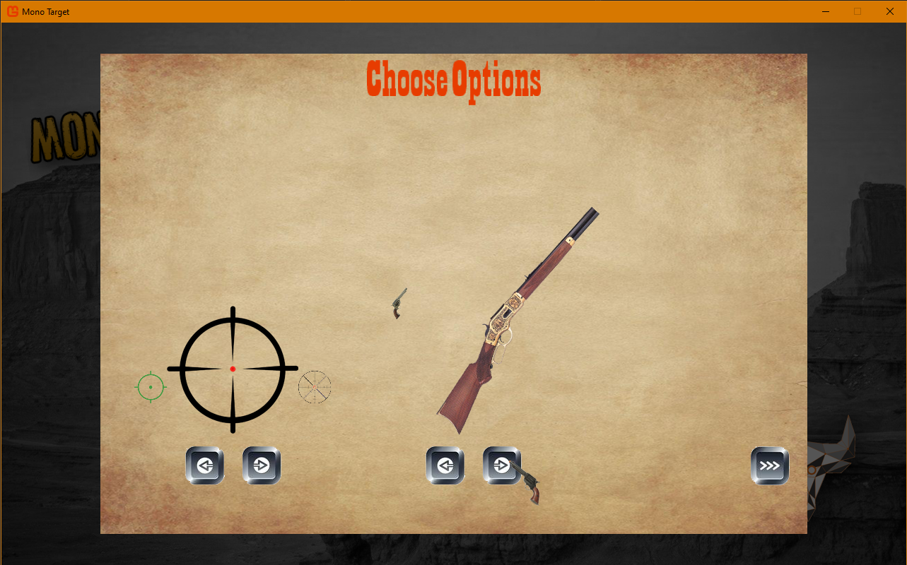
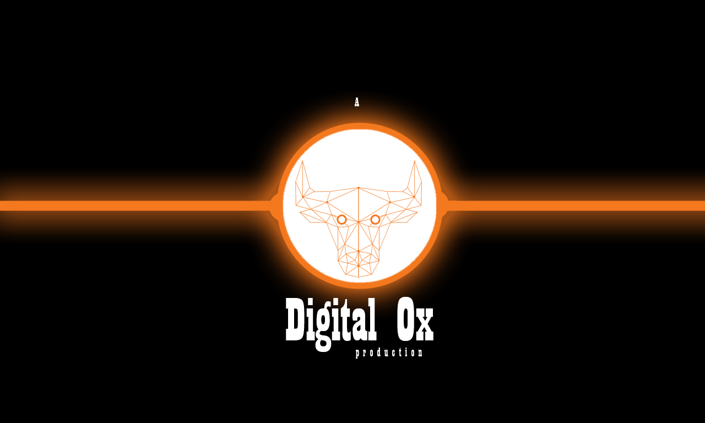

# MonoTarget - Day 14

## Thoughts
The UI needs some enhancements to have buttons that look like they are pressed but the existing ScreenManagement doesn't have buttons or graphical menu entries.  Thought about using some other library like MonoGame.Extended.  However, the time to learn another library (and not guaranteed it'll work) so I decided to just create a quick rudementary graphical button UI system intertwined with the ScreenManagement.

## Work
Screenshot  

Video  

## Code
- Added UIButtons for the Start Game options screen.
- Started down the road of having multiple guns.
- Fixed mouse firing bug, change the main Input routine to properly handle mouse input.
